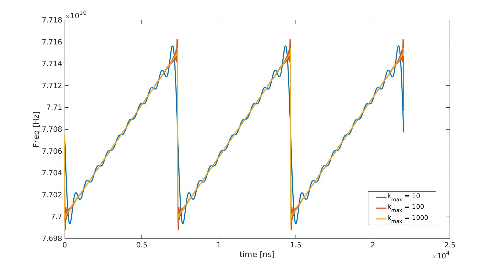
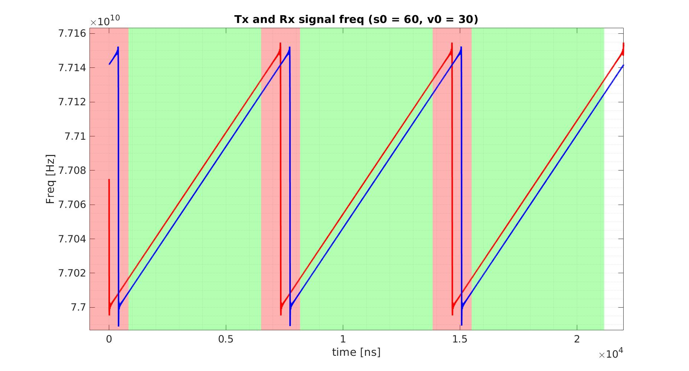
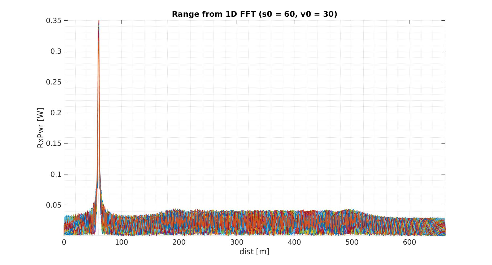
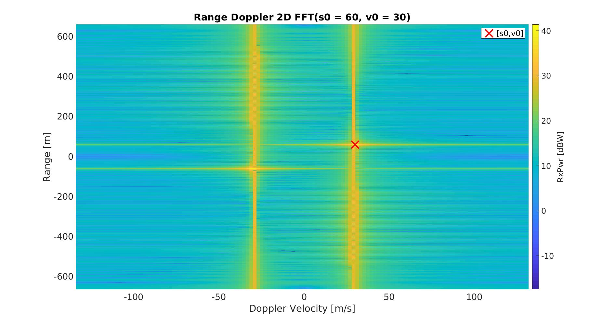
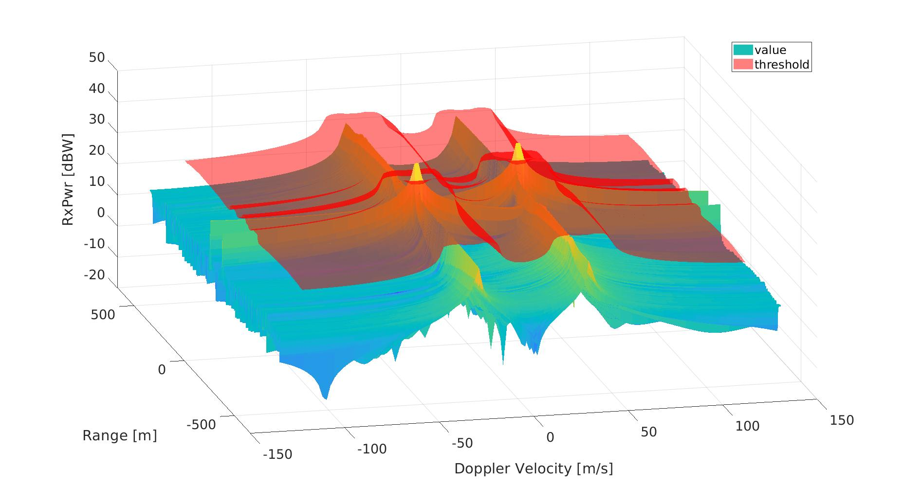
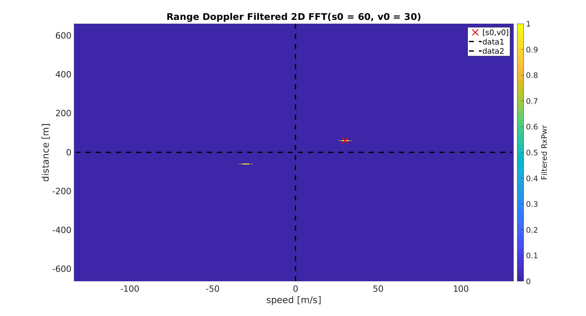

# Radar Target Generation and Detection
Project for Udacity's Sensor Fusion Engineer Nanodegree Program

----
## Project Goals
This project reports a MATLAB based Radar Target Genetation and Detection following this steps:

* Configure the FMCW waveform based on the system requirements.
* Define the range and velocity of target and simulate its displacement.
* Simulate the signal propagation
* Process the transmit and receive signal to determine the beat signal
* Crop received signal
* Perform Range FFT on the received signal to determine the Range
* Perform the CFAR processing on the output of 2nd FFT to display the target.

----
### FMCW waveform configuration
In this the waveform parameters are extracted from some initial Radar specification:
| symbol | Parameters        | Value           | Unit  |
| :------------- | :------------- |:-------------:| -----:|
| F | Radar operation frequency| 77 | GHz |
| dmax | Radar max range | 200 | m |
| dres| Radar resolution | 1 | m |
| vmax | Radar max detectable speed | 100 | m/s |
| c  | Speed of light | 3e8 | m/s |

The wavelength (*lambda*) can be computed as
```
lambda = c/F ~= 4 mm
```
Given this parameters it is possible to extract the sweep bandwidth (*Bsweep*) as:
```
Bsweep = c/(2 * dres) ~= 1.5e8 Hz
```
The time of the sweep called chirp time (*Tchirp*) can be extracted as:
```
Tchirp = ch_factor * 2 * dmax/c ~= 7e-6 s
```
where *ch_factor* is a user defined constant (usually between 5 and 6), that ensures with some margin that the chirp time is more than the time that the wave need to go back and fort from the obstacle (dmax/x).
Knowing *Tchirp* and *Bsweep* obtaining the slope of the frequency increment of the signal (*m*) is trivially found as:
```
m = Bsweep/Tchirp ~= 2e13
```

----
### Define the range and velocity of target
A simple constant model of the target was simulated. Given the initial position *s0* and the initial relative speed *v0* it is possible to obtain the position *s(t)* and the speed *v(t)* at a generic time *t* as:
```
s(t) = s0 + v0*t
v(t) = v0
```
----
### Signal propagation
*Frequency-Modulated Continuous Wave radars* (FMCW) are a special type of radar sensor which radiates continuous transmission power. With FMCW radar it is possible to measure simultaneously the target ranges and its relative velocity.
A *Frequency Modulated Continous Wave* (FMCW) is a signal in which the frequency increases/decreases with time. The two most common waveform pattern used for FMCW radars are sawtooth and triangular. In this project a upramp sawtooth signal is simulated.
To construct the frequency profile the infinite Fourier series was implemented (see this [link](https://en.wikipedia.org/wiki/Sawtooth_wave) for more information).
```
f(t) = F + Bsweep*(-1/pi * S(t) + 0.5)
```
where S(t) is the summation of Sk for k from 1 to infinity where Sk is defined as:
```
Sk(t) = sin(2*pi*k/Tchirp*t)/k
```
Than the phase is extracted from the frequency by means of a proper integration procedure that can be done symbolically:
```
phase(t) = 2*pi*(Bsweep*(Tchirp/(2*pi*pi)*C(t) + 0.5*t) + F*t)
```
where C(t) is the summation of Ck for k from 1 to infinity:
```
Ck = cos(2*pi*k/Tchirp*t)/(k*k)
```
To evaluate this function in a finite computation time the summation is done for k ranging from 1 to 1000.
In the figure below a sawtooth profile generated with different k value is reported.

See how increasing the *k* max value the approximation gets better.


The output signal *Tx* is modelled as:
```
Tx(t) = cos(phase(t));
```
and the received signal *Rx* is modelled as:
```
Rx(t) = cos(phase(t - delay(t)));
```
where *delay(t)* is the time that the signal takes to go back and forth from car to the obstacle and can be computes as:
```
delay(t) = 2*s(t)/c
```
In this procedure we use the approximation that the relative speed is small compared to the speed of light and therefore the forward travelled space is equal to the backward travelled space (this is not true if there is relative motion between the objects but is a good approximation as long as the relative velocity is much smaller than the speed of light).

Once we have we have the model of the transmitted (*Tx(t)*) and received (*Rx(t)*) signal we can mix them 
```
Mix(t) = Rx(t)*Ty(t)
```


*Mix(t)* is the result of a product between 2 sinusoidal wave and therefore it is a sinusoidal wave and its frequency is by 2*(s(t)*Slope + F*v(t))/c . The frequency of the Mix function is therefore dependent on the range and on the relative velocity. 

----
### Cropping Mix signal
The edge of the sawtooth profile generate noise since in the jump the correspondence between Tx and Rx signal is discontinuous. To limit the noise a total time of 830 ns was cut of the saw profile from its start and its end as depicted in the following picture:

To sample properly this wave a sample time of 5.5 ns was imposed generating a total of 1324 of which 1024 are the ones that fall in the green area and that will be used in the  fast Fourier transform (FFT). 
The total simulation time is ~1 ms and in this time a total of 128 chirp profile is collected.
The collected data are organized in a matrix with 1024 rows (*Nr*) corresponding to the number of valid sample taken for each chirp and 128 columns (*Nd*) corresponding to the number of collected chirp. The rows space it is also called range space and the column doppler since these dimension of the matrix will be used to estimate the range and the doppler velocity respectively.
As a remark note that it is ideal to have *2^n* value both in doppler and range for the ease of running the FFT.

----
### Range FFT
Working on the 128 rows of the matrix collecting the *Mix* signal it is possible to extract the range estimation using a 1D FFT. The FFT will convert the 128 discrete signals in 128 signals in the frequency spectrum. In order to convert the frequency *fs* to a range estimation the following formula can be used:
```
s = c*fs/(2*slope)
```
Using this formula to convert the frequency used in the FFT is it possible to obtain the following picture:

These 128 graphs in the frequency spectrum show a pick at 60.77 m. The estimated value is close to the real one that for this case was 60 m.

----
### Range-Doppler FFT
It is possible to obtain a range doppler map by running a 2D FFT on the mixed signal. The range doppler map is reported in the following picture:

As can be seen the graph is symmetric. Only using the measurements coming from the lidar sensor a object moving in front of the car with a relative velocity of 30 m/s at a range of 60 m can not be differentiated from an object moving at 30 m/s at -60 m. As a matter of fact one can discriminate between these 2 situation by knowing the direction of the radar beam.


----
### CFAR processing
The signal extracted from the radar measurement it is characterized by the presence of noise. An approach to clutter thresholding is to use dynamic thresholding. Dynamic thresholding involves varying the threshold level to reduce the false alarm rate. In the project I have used a technique called CFAR (Constant False Alarm Rate). With this technique, the noise at every or group of range/doppler bins is monitored and the signal is compared to the local noise level. This comparison is used create a threshold which holds the false alarm rate constant.  In order to detect outlayers with a constant false alarm rate CFAR varies the detection threshold based on the point surroundings. The CFAR technique estimates the level of interference in radar range and doppler cells caller "Training Cells" that can be on either or both side of the "Cell Under Test" (CUT).
A CUT is an outlayer if its value it greather than the standard deviation monitored on the Training Cells multiplied by a threshold factor (Offset). To improve the system stability "Guard Cells" are usually also defined around the CUT. The purpose of the Guard Cells is to avoid the target signal from leaking into the training cells that could adversely affect the noise estimate.
In this project iteratively was found that a good area if the Training Cells was a 121x15 rectangular area blanket in the middle from a 21x5 rectangular area at the center of which is located the CUT cell. The imposed threshold is of 13 Db.
The following 3D figure shows in red the dynamic thresholding and in blue the Range-Doppler FFT. Note that the Training and Guard cells introduce a padding around the CUT cell and eventual peaks inside this padding area are discarded.

We have 2 peaks that overcome the red volume and this is correct as expressed previously because these 2 points express 2 symmetric situation from which it is not possible to discriminate from the radar measurements.

The result of this thresholding process can be summarized in the following binary image were the peak region are represented in yellow and the noisy part of the signal is blue.

Note how well the yellow spot estimate the true value marked with a red cross partially confirming the validity of the proposed setup.